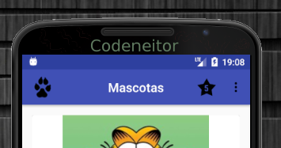
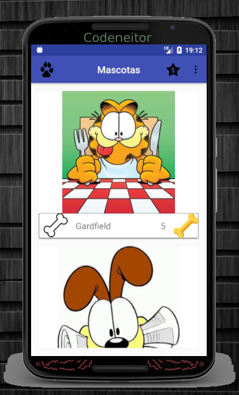
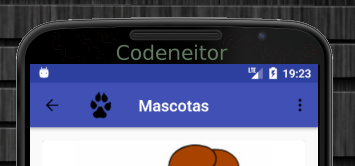
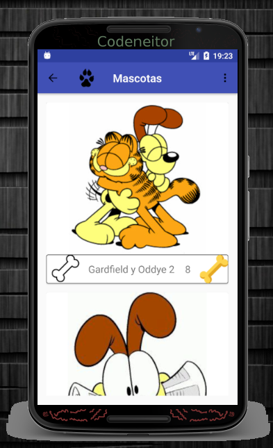

# MascotasRecyclerView
Proyecto de la semana 3 del tercer curso.
# Trabajo realizado en la semana 3.

 * Se agrega el Action View al Toolbar como lo indica en la actividad.

 * RecyclerView usado para mostrar la lista de mascotas, reciclando un CardView

* Se crea un menú para la pantalla favoritos

 * RecyclerView usado para mostrar la lista de Favoritos.
 Se agregan 5 elementos como lo indica la actividad.
